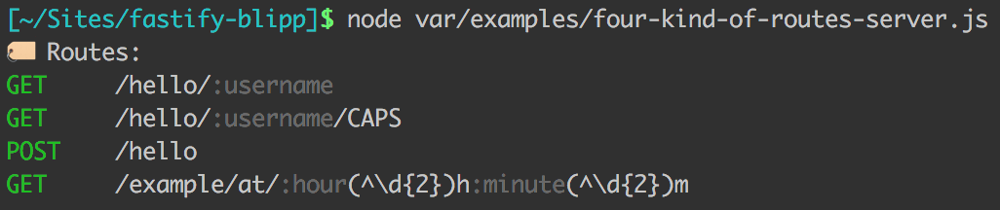

`fastify-blipp` prints your routes to the console. So each time your server starts, you know which endpoints are available.

(inspired by [blipp](https://github.com/danielb2/blipp) hapijs plugin)

## install
```
npm i fastify-blipp
```

## usage
It is important to register the plugin as soon as possible, so it starts to listen for the new routes.

```javascript
import { fastify as fastifyInstance} from "fastify";
import blippPlugin from "fastify-blipp";

const fastify = fastifyInstance();

// register it as early as possible
fastify.register(blippPlugin);
//or if you wan't custom log function
// fastify.register(require("fastify-blipp"), {blippLog: (msg) => console.log(msg)});

fastify.register(
    (fastify, {}, done) => {
        fastify.get("/hello/:username", async (req, reply) => ({
            greeting: `Hello, ${req.params.username}`
          }));
          fastify.get("/hello/:username/CAPS", async (req, reply) => ({
            greeting: `Hello, ${req.params.username.toUpperCase()}`
          }));
          fastify.post("/hello", async (req, reply) => ({
            greeting: `Hello, ${req.body.username}`
          }));
          fastify.get(
            "/example/at/:hour(^\\d{2})h:minute(^\\d{2})m",
            async (req, reply) => ({
              hour: req.params.hour,
              minute: req.params.minute
            })
          );
        done();
    }
)

const start = async () => {
  try {
    await fastify.listen({port:3000});

    fastify.blipp();

    console.log(`server listening on ${fastify.server.address().port}`);
  } catch (err) {
    console.error(err);
    process.exit(1);
  }
};

start();
```

## result



